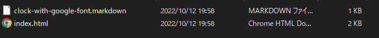
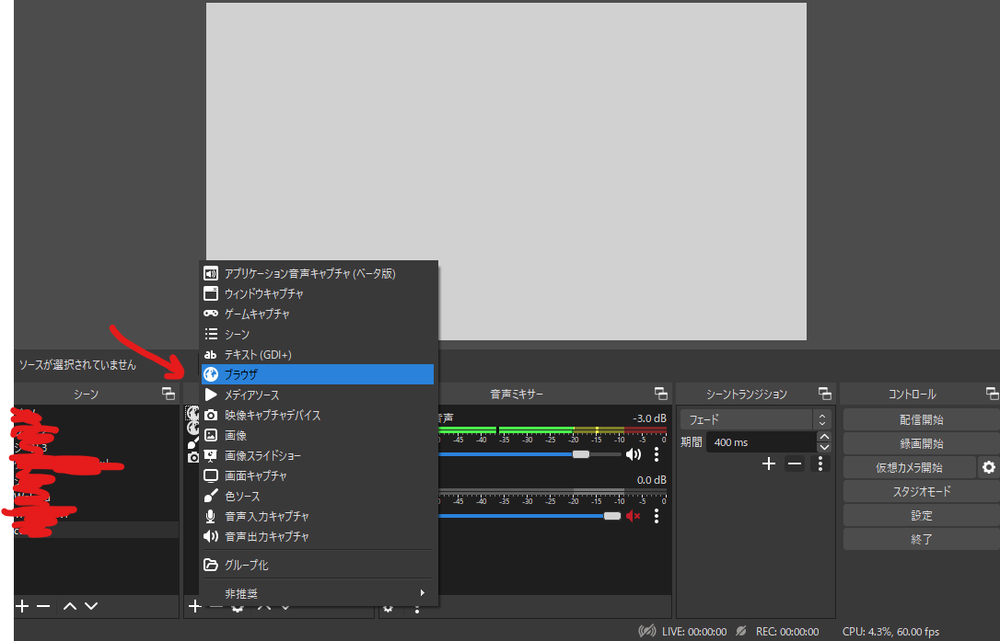
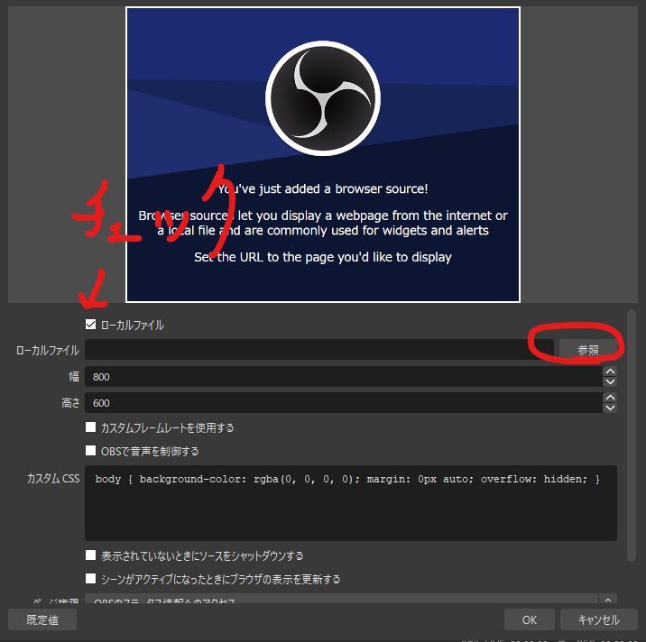
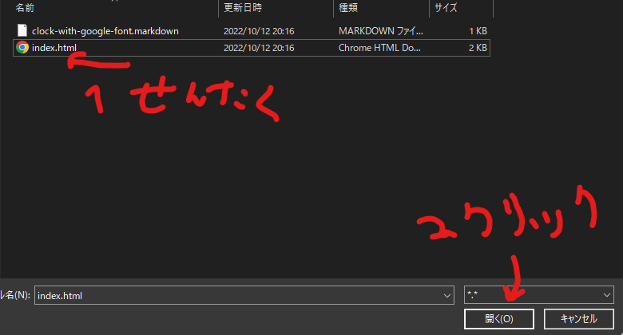

試しに作ってみたOBSで使える時計のリソース(html)です
フォントはGoogle fontsをお借りしてます

# htmlをOBSで表示する

htmlは時計を表示してくれるファイルをCodepenからコピペして適当なファイル名で保存していきます

## 手順

以下のサイトにアクセスして、ZIPファイルをダウンロードします

https://gist.github.com/sasasoni/9b9ecb30ccb05d7f36b83d576c43d6ae/archive/7c299938c885d6365175e9caabcceff8c1c1ddb2.zip

ZIPファイルを展開します。




`index.html`を適当な場所に保存します

OBSの`＋`マークから、ブラウザを選択します



↓のようにローカルファイルにチェックし、`参照`から先程の保存した`index.html`を選択します





`OK`を押すと、時間が表示されるHTMLを追加できます

## その他

文字の大きさを変えるときは、シンプルにOBS内でサイズを変えてもいいですし、HTML内の`rem`の値を変えてもいいです

```html
  <style>
    #view_clock {
      font-family: 'Rubik', sans-serif;
      font-size: 10rem; /*←ここをかえる*/
    }
  </style>
```